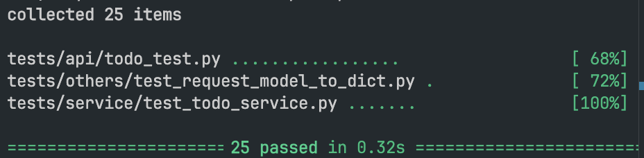
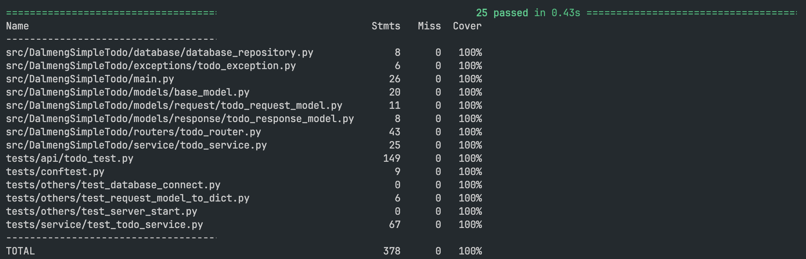

# ✅ TDD and 100% Test Coverage Guide

- This guide helps you test your app using `pytest` and achieve 100% test coverage with `coverage.py`.

---

## 🎯 Goal 1: Run tests with `pytest`

- To run all tests in your project:

```
pytest .
```

<br />

- Result



---

## 🎯 Goal 2: Check and Achieve 100% Test Coverage

- To measure test coverage and ensure you're covering everything:

```
coverage run -m pytest
```

<br />

- Result



---

## 🌐 [Optional] Generate Local Coverage Report

If you'd like to view a detailed coverage report in your browser:

```
coverage report
coverage html
```
Then open the `htmlcov/index.html` file in your browser to see the results.


